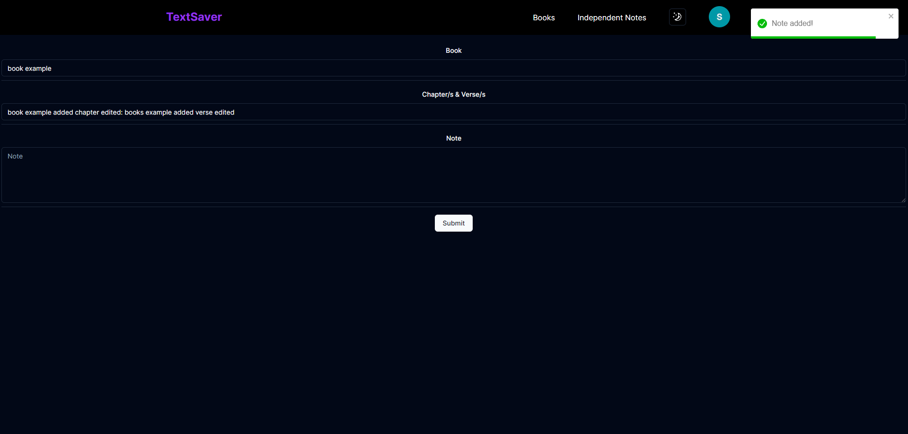

This is a [Next.js](https://nextjs.org/) project bootstrapped with [`create-next-app`](https://github.com/vercel/next.js/tree/canary/packages/create-next-app).

The app is hosted at https://text-saver.vercel.app

TextSaver is a web app to save notes, there are two sections, books where you can add a book and notes about chapters of that book, and independent notes which are just simple notes that are not related to anything

This is the login page, for now only google signin is avaliable.

This is the home page:

There is also a dark mode functionality:

The books and independent notes sections on the navbar are dropdowns:

Here a independent note can be added:

Here a book can be added: (the verse/s field in optional, it is nullable in the database)

The required fields must be filled to be able to submit the form (this works the same for the independent notes.)

This is the see books and independent notes section, it also have pagination, 
you can choose what number of items to display on a page.

Search functionality

Limit items displayed on the page

First page example

Second page example

If there isn't data to display a nothing found is shown

By pressing the veiw button we can add chapters to the respective book or delete it, 
and a list of all the chapters related to that book is displayed

By pressing New Chapter/s and Verse/s we can add more chapters related to the book

By pressing View Chpater/s & Verse/s we go to that chapter's page

Here we can delete the chapter, edit it or add a new note, 
also a list of all the notes related to the respective chapter is displayed
 

Here is the form to edit the chapter

This is the add note related to the chpater form:

The new note has been added

By pressing view note we get to that note's page where it can be edited or deleted

Pressed delete button

The delete functionality is the same for everything
 

The profile picture is also a dropdown menu where you can see your account details, 
go to the github repo of the project or sing out

This is the profile page

